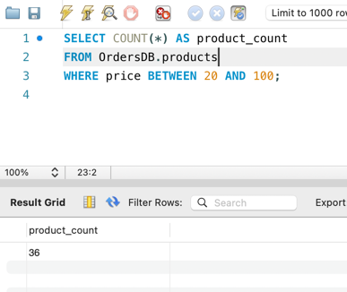
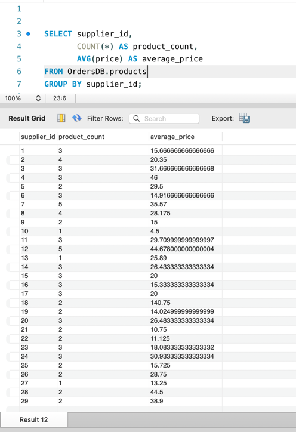

# goit-rdb-hw-03
### 
```
-- Всі стовпчики з таблиці products
SELECT * FROM OrdersDB.products;

-- Тільки name та phone з таблиці shippers
SELECT name, phone FROM OrdersDB.shippers;
```


### 
```
SELECT 
    AVG(price) AS average_price,
    MAX(price) AS max_price,
    MIN(price) AS min_price
FROM OrdersDB.products;

```


### 
```
SELECT DISTINCT category_id, price
FROM OrdersDB.products
ORDER BY price DESC
LIMIT 10;

```


```
SELECT COUNT(*) AS product_count
FROM OrdersDB.products
WHERE price BETWEEN 20 AND 100;


```



```
SELECT supplier_id, 
       COUNT(*) AS product_count,
       AVG(price) AS average_price
FROM OrdersDB.products
GROUP BY supplier_id;


```

